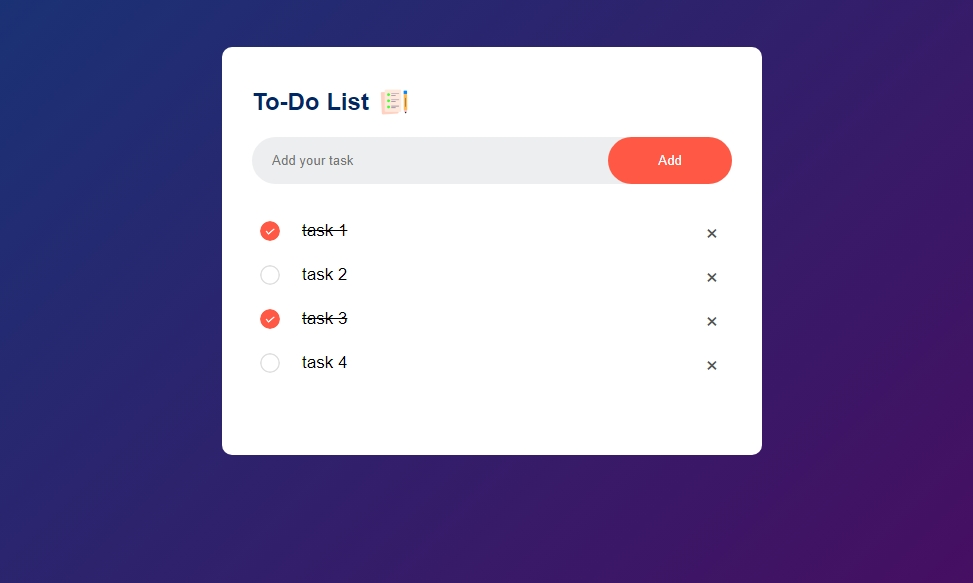

# 📝 To-Do App

Welcome to the **To-Do App** project! This is a simple yet elegant web application that allows you to manage your daily tasks effortlessly. Built with HTML, CSS, and JavaScript, it features a clean design and intuitive user interface.

## 🚀 Features

- **Add Tasks**: Quickly add new tasks to your to-do list.
- **Mark as Completed**: Click on a task to mark it as completed.
- **Remove Tasks**: Easily remove tasks that are no longer needed.
- **Local Storage**: Your tasks are saved in the browser's local storage, so they persist even after refreshing the page.

## 🛠️ Technologies Used

- **HTML**: The structure of the app.
- **CSS**: Styling for a beautiful and responsive design.
- **JavaScript**: Functionality to manage tasks and local storage.

## 📂 Project Structure

```bash
├── index.html     # Main HTML file
├── style.css      # CSS for styling the app
├── script.js      # JavaScript for app functionality
├── images         # Directory for images (icons and screenshots)
│   ├── icon.png
│   ├── unchecked.png
│   ├── checked.png
│   └── screenshot.png
└── README.md      # This README file
```

## 📋 Usage

1. **Clone the Repository**
    ```bash
    git clone https://github.com/yourusername/todo-app.git
    ```
2. **Open `index.html` in your Browser**

## 📺 Tutorial

For a step-by-step tutorial on building this To-Do App, check out the video [here](https://youtu.be/G0jO8kUrg-I?si=_WOzdKNtL7RAN3Yv).


## 📸 Screenshots



## 👏 Contributing

Feel free to contribute to this project by submitting issues or pull requests.

## 📄 License

This project is licensed under the MIT License

---

Thank you for checking out the To-Do App! Happy coding! 🎉
